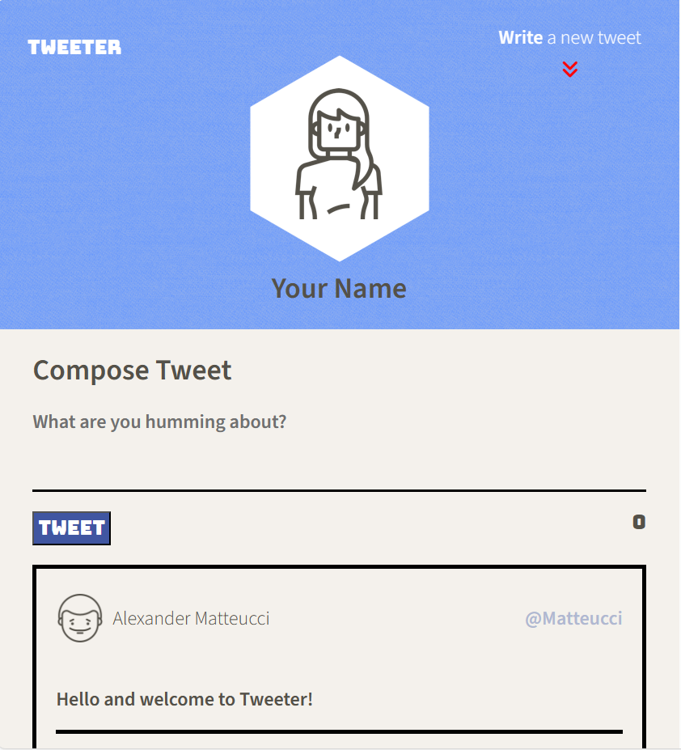
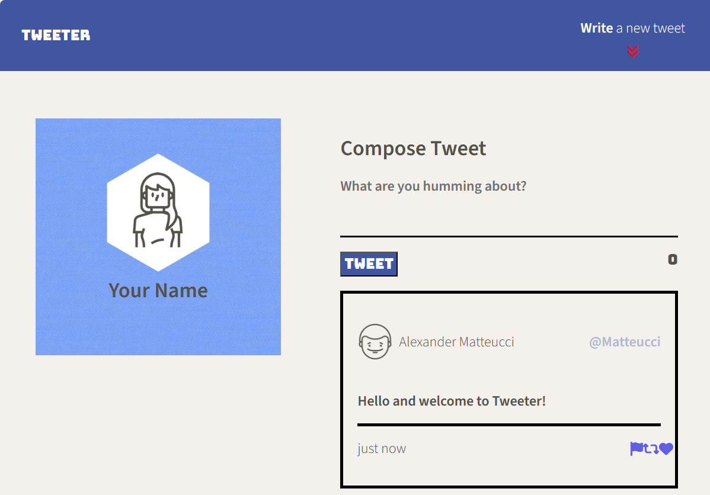
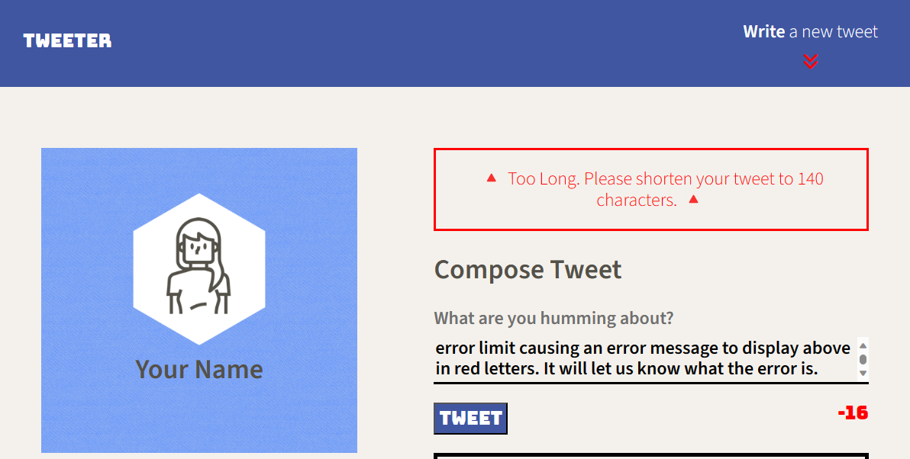

# Tweeter Project

Tweeter is a simple, single-page Twitter clone.

A simple single-page AJAX-based Twitter clone that uses jQuery, HTML5, and plain ol' CSS3 to help web bootcamp students get comfortable with their front-end chops with those technologies. 

## Getting Started

1. Fork this repository.
2. Clone your repository onto your local device.
3. Install dependencies using the `npm install` command.
3. Start the web server using the `npm start` command. The app will be served at <http://localhost:8080/>.
4. Go to <http://localhost:8080/> in your browser.

## Dependencies

- Express
- Node 5.10.x or above
- body-parser
- chance
- md5

## Screenshots

